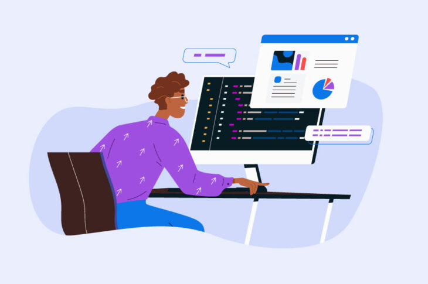
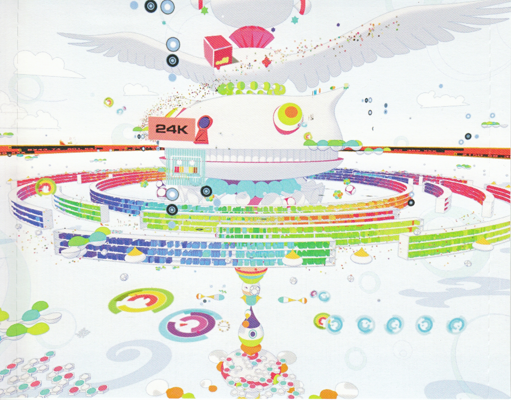
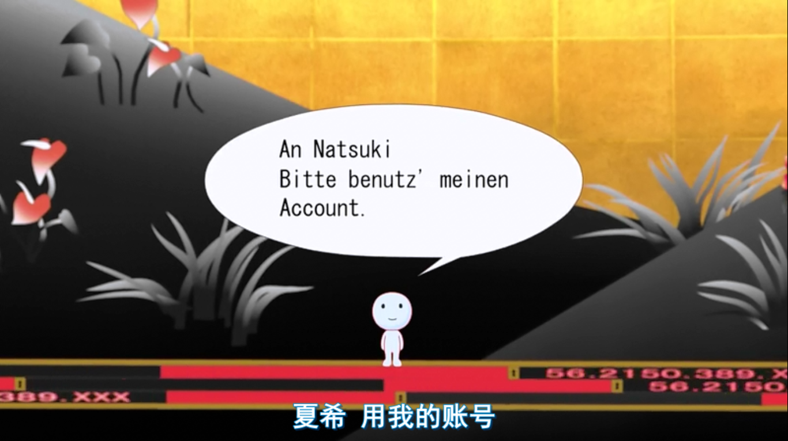

# 前端十年

Kimima(马申彦)
2023.12.2

---

# 目录

- 个人介绍
- 工程师思维与学生思维
- 大厂经历为何吃香
- 后互联网时代前端的冰与火

---

# 个人介绍

- 现就职于阅文，曾任职于腾讯、豆瓣等互联网大厂
- 负责开发维护腾讯文档、豆瓣阅读等国民级产品
- 在 JSConf China、QConf 等技术大会进行演讲
- 为 Webpack 等知名前端开源仓库提交代码

---

# 工程师思维与学生思维
## 一些意料之中的偏见

- 前端简单，有手就能干 ✅
- 前端天花板比较低 🚫
- 前端不需要编程知识 🚫
- 低代码将给前端带来致命打击 🚫

---

<!--
_class: lead
-->

“为什么我选择了前端这个职业？”
在设计和后端之间

%%{init: {"flowchart": {"htmlLabels": false}} }%%
flowchart LR
    design([设计])
    f2e([前端])
    be([后端])
    app([客户端])
    intuitive((直观、外在))
    implicit((隐含、内禀))
    style f2e fill:#f9f
    design --> f2e
    f2e --> be
    be --> app
    intuitive --- design
    app --- implicit

---

# 工程师思维与学生思维
## 转变思维

- 避免标签式学习（Flash -> HTML/CSS/JS -> K8S/WASM -> AI）
- 前端的意义在于做好 web 的浏览器部分，而不是以这个框束缚自己
- 交流比竞争更有用
- 长远的职业规划 vs 眼前的经济利益
- 知其然，知其所以然

---

## 转变角色

#### 工程师
具有钻研精神
责任意识更强
更多作为个体

<!-- &nbsp; -->

#### 学生
富有探索精神
需要师长担责
更多作为集体

---

# 大厂经历带来了什么

&nbsp;
✅ 完善的行政体系
✅ 良好的职业上升路径
✅ 更大的挑战与机遇
✅ 规范的工作方式

&nbsp;
&nbsp;
❌ 凌乱的屎山代码
❌ 更多的无形诱惑
❌ 个人价值体系的破坏
❌ 温水煮青蛙

---

# 褪去大厂光环后

- 你是一个什么样的**人**
- 你想要什么样的**生活**
- 你的钱够花多久？
- 你对办公室文化是否眷恋？
- 你是否愿意继续留在互联网行业？

---

# 该如何找到下一家大厂 or 适合自己的厂

- 规模与品牌
- 人才配套福利
- 好的领导非常重要
- 公司对技术的重视程度（可参考是否赞助技术开源活动）
- 项目与先前经历的贴合度
- 舒适圈

---

<!--
_class: lead
-->

# 前端已死？

---

# 后互联网时代

- 技术选型五花八门
- 历史包袱非常沉重
- 从业水平两极分化
- 粗放管理不再有效

---

# 程序员的价值

%%{init: {"flowchart": {"htmlLabels": false}} }%%
flowchart LR
    maintainer(("`维护老旧系统
    背锅`"))
    explorer(("`开拓新的航路
    获得未来市场
    e.g AI`"))
    promoter(("`鼓吹技术价值`"))
    consultant(("`甄别技术价值`"))
    trainer(("授人以渔"))
    maintainer --- explorer
    maintainer --- promoter
    explorer --- consultant
    promoter --- consultant
    consultant --- trainer

---

# 前端的价值

- 最快捷的输出 UI
- 最具兼容性的信息交互媒介
- 海量的成熟工具库
- 最激进的技术试验田
- 最广泛的 HTTP 接口适配

---

# 互联网各职业的未来

- 产品经理 -> 销售
- 视觉设计 -> Midjourney / Stable Diffusion 参数调节器
- 交互设计 -> 人类行为实验员
- 后端 -> 云操作系统开发
- 客户端 -> 嵌入式开发
- 前端 -> All of **旧互联网**

---

# 前端的未来

- 大一统的构建发布方式（所有特性随便写随便用，自动分析性能瓶颈）
- 制定文档描述规范，类似 RSS，一种实践是 Headless CMS
- WebRTC P2P 实时通讯
- 离线优先的边缘计算
- 混合输入（语音、视觉、其他传感器）

---

## 令人心动的简历💓 

---

# Thank you

