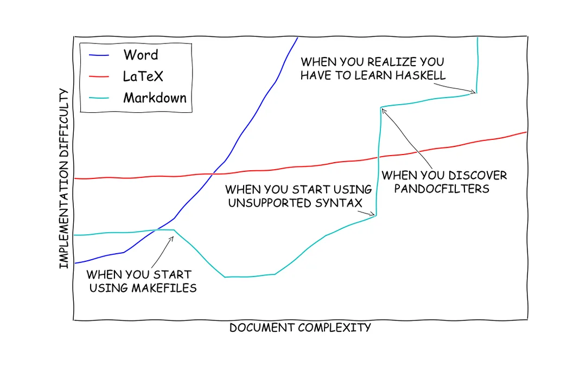
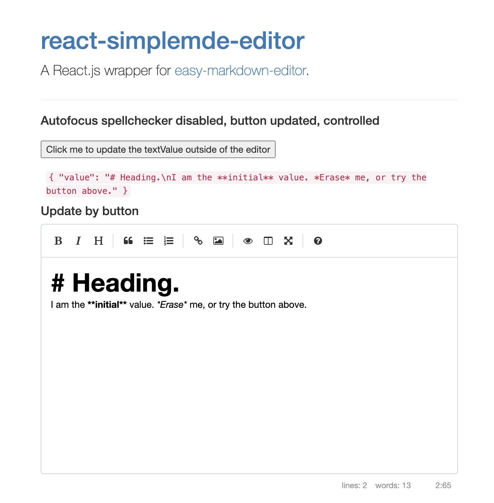
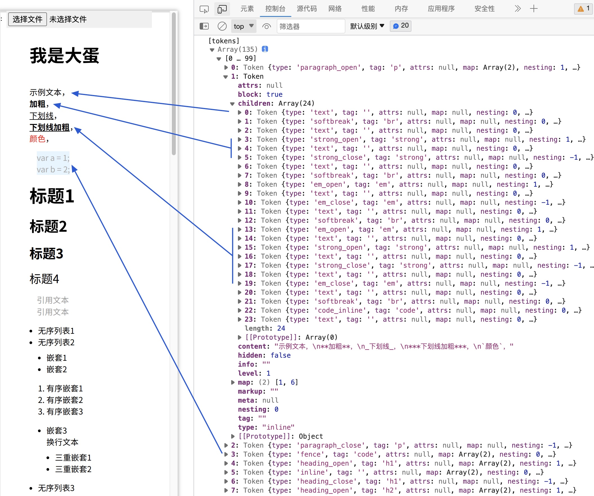
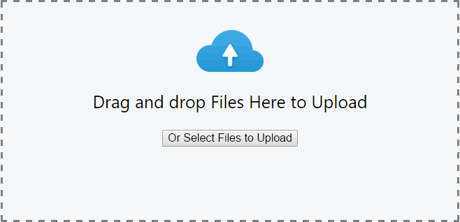
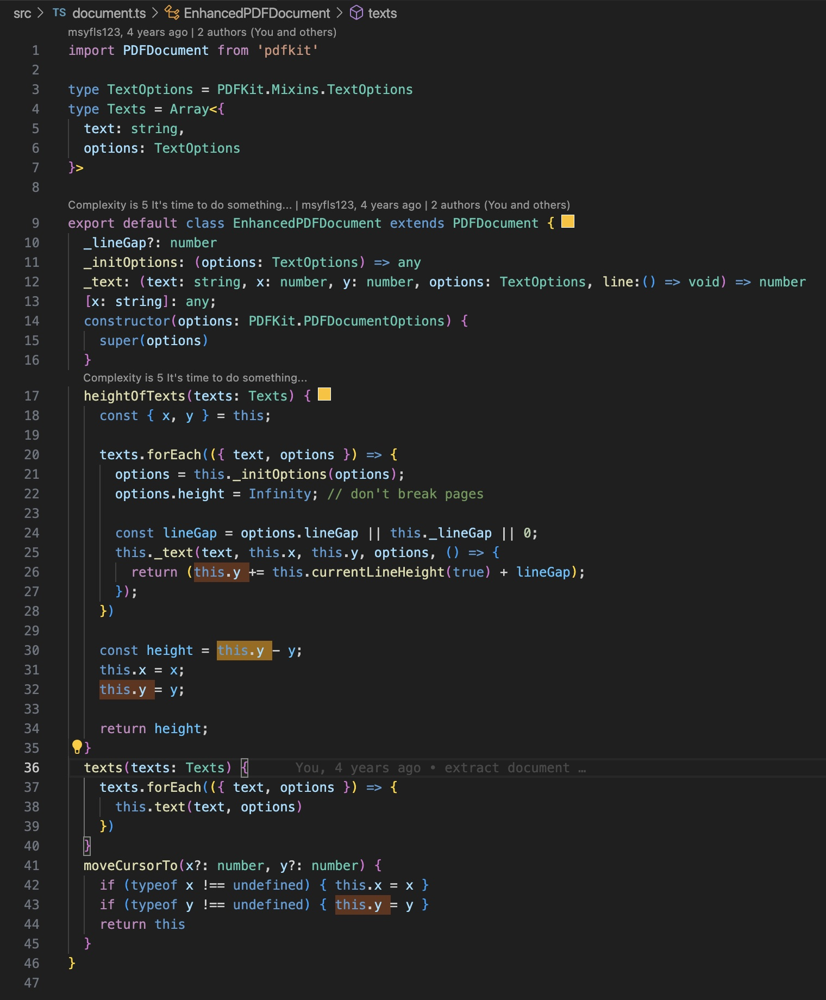
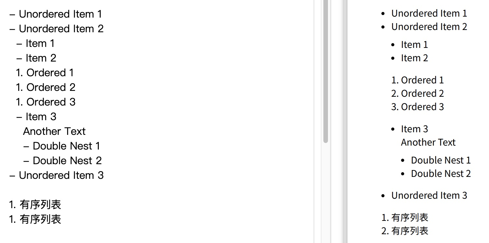
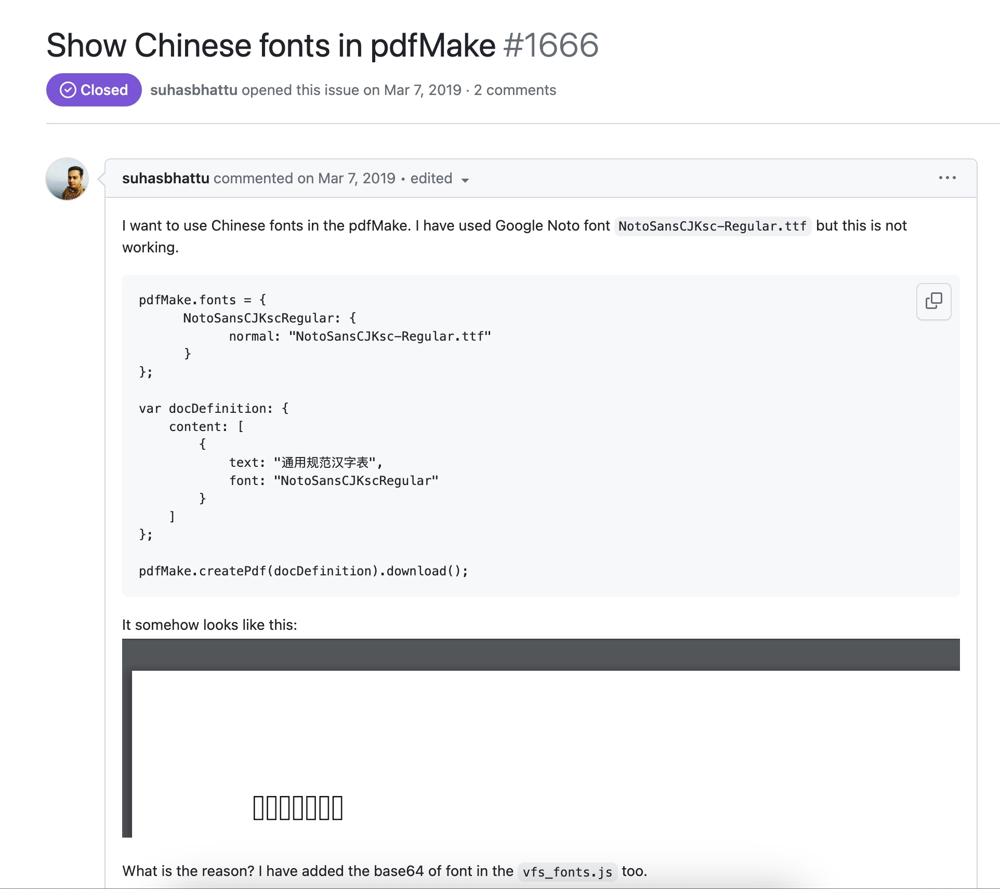
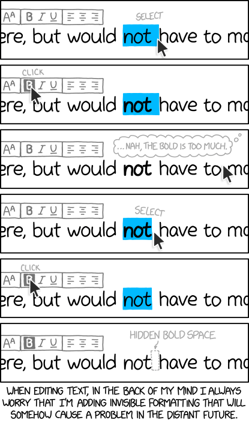

# Introduction
Speaker: **Shenyan Ma** (aka **Kimi**)

Aug. 2023

---
# Career

- Worked as front end engineer on Tencent, Douban Read, Snail Games(internship).
- Master of Design, learn about product design, UX design and ergonomics.
- Speeches at JSConf China, QConf in Tencent.
- Contributions to open sources like Playwright, Webpack etc.

---

# Knowledge

- Front End: React / RxJS / Lodash / Cycle.js
- Language: TypeScript / Rust / Python / C++ / $\LaTeX{}$
- Build Tools: Rollup / Gulp / Webpack

---

# Project

### TencentDocs Desktop

Electron Application
* Local edit for Office document
* C++ Addons
* Monitor & Report
* CI/CD pipeline

---

# Project

### Douban Read

* TypeScript refactoring
* GraphQL API
* Mobile App rich text editor
* Book search engine

---

<!--
_class: lead
-->
# [MaTeX](https://msyfls123.github.io/MaTeX/)

Markdown-to-PDF editor

---

## Motivation

Bro, I need your help!

---

## Motivation

---

## Why not Word?

&nbsp;

&nbsp;
- No installation
- Easy to use
- Open for extension

_Outdated Tech Makes Workers Feel Less Productive, More Likely To Quit_

---

## Basic Steps

sequenceDiagram;
    participant editor as react-simplemde-editor
    participant tokenizer as markdown-it
    editor->>tokenizer: raw text
    participant parser
    tokenizer->>parser: tokens
    participant pdfmake as pdfmake
    parser->>pdfmake: contents
    pdfmake->>editor: PDF document

---

## Visual Editor

- WYSIWG
- **Pure Text Output**
- Toolbar
- Syntax Guide

---

## Tokenize

- Nested Structure
- Tags VS **Entity**
- Pagination
  - soft break
  - paragraph

---

## Image?

* Editor **NOT** support image upload. [#202](https://github.com/RIP21/react-simplemde-editor/issues/202)
* Trade-off: external image uploading
* Problem: Where to upload?

---

## Storage in JavaScript

|Category|Items|Visibility|Query|
|---|:--:|---|---|
|Pure File||⭐⭐⭐|⭐|
|Browser||⭐⭐|⭐⭐⭐|
|Server| |⭐|⭐⭐⭐|

---

## Render Mode

Client/Sever Mode

sequenceDiagram;
    client->>server: Text Data
    rect rgba(200, 150, 255, .3)
    client->>server: Image(latency, authentication)
    server-->server: Store Image
    end
    server->>client: PDF(latency)

Single Mode ✅

flowchart TD;
    editor(Editor)-->text(Text Data)
    editor-->image(Image)
    text-->token(Token)
    token-->content(Content)
    image-->content
    content-->PDF

---

## Pagination

* Precipitation（沉淀）
* **Pagebreak among paragraphs** destroied my pagination algorithm
* Two repositories, one dream.
* PDFMake is also PDFKit
* I'll always miss the time in struggling with pagination.

---

## Features

Nested List

&nbsp;

Preview Scroll Sync 🚫
Fallback: `#page=xxx` anchor

---

## Last Critical Problem

&nbsp;
&nbsp;&nbsp;&nbsp;&nbsp;&nbsp;

---

## <ruby>> 27MB!<rt>Chinese fonts</rp></ruby>

sequenceDiagram;
    autonumber
    client->>server: Text Data
    client->>server: Image
    loop generatePDF
        client->>server: Text Data
        server->>client: PDF(expensive)
    end

Client/Sever Mode

flowchart TD;
    fonts["load fonts(expensive, once)"]-->editor(Editor)
    editor-->text
    editor-->image(Image)
    text-->content(Content)
    image-->content
    fonts-->content
    content-->PDF
    PDF-->editor

Single Mode ✅

---

## Futhermore

### User Feedback
- Support import/export raw data(markdown text)
- Pause/Resume PDF generation periodically
- Deploying web application
  Only domain bill, cloud object storage and CDN is **FREE**

### Vision

- Import & Export both text and images(zip format)

---

# Thanks 

_To avoid errors like this, we render all text and pipe it through OCR before processing, fixing a handful of irregular bugs by burying them beneath a smooth, uniform layer of bugs._

