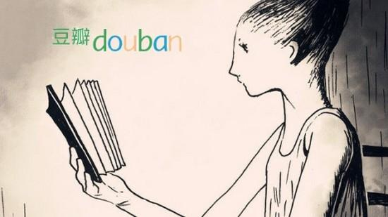

# Introduction
Speaker: **Shenyan Ma** (aka **Kimi**)

Aug. 2023

---
# Career

- Worked as front end engineer on Tencent, Douban Read, Snail Games(internship).
- Master of Design, learn about product design, UX design and ergonomics.
- Speeches at JSConf China, QConf in Tencent.
- Contributions to open sources like Playwright, Webpack etc.

---

# Knowledge

- Front End: React / RxJS / Lodash / Cycle.js
- Language: TypeScript / Rust / Python / C++ / $\LaTeX{}$
- Build Tools: Rollup / Gulp / Webpack

---

# Project

### TencentDocs Desktop

Electron Application
* Local edit for Office document
* C++ Addons
* Monitor & Report
* CI/CD pipeline

---

# Project

### Douban Read

* TypeScript refactoring
* GraphQL API
* Mobile App rich text editor
* Book search engine

---

<!--
_class: lead
-->
# MaTeX

Markdown-to-PDF editor

---

## Motivation

---

## Architure

graph TD;
    A-->B;
    A-->C;
    B-->D;
    C-->D;

---

## Known issues

- Not support images between paragraphs.

